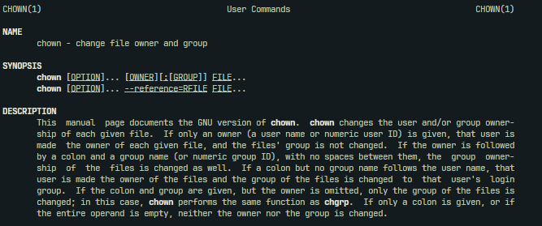

<div align="center">
    
</div>


# Advance File
Yoo, materi kali ini sebenarnya lanjutan dari materi basic [operation file dan folder](../../basic/13_operation_file_dan_folder/). Didalam materi ini akan dijelaskan beberapa hal yang kerap kali berguna dalam management sebuah file

# Change Owner
Merupakan command yang digunakan untuk mengubah status kepemilikan dari file / folder. Ini sering digunakan untuk mengubah file tersebut punya siapa. Sebagai contoh disini kita punya 1 folder dan 1 file yang udah di save di `/opt`.

```bash
root@alpha:/opt/shellscript# ls -la
total 12
drwxr-xr-x 3 root root 4096 Oct  1 10:33 .
drwxr-xr-x 5 root root 4096 Oct  1 10:34 ..
drwxr-xr-x 2 root root 4096 Oct  1 10:33 advance_file
-rw-r--r-- 1 root root    0 Oct  1 10:33 glorious  
```

Dari sample tersebut `glourious` memiliki permission 644 yang dimana untuk user selain root hanya bisa diperbolehkan membaca tanpa write dan execute. Disini kita cobaa ubah ke chmod 711 agar user lain tidak bisa baca dan write ke file

```bash
root@alpha:/opt/shellscript# chmod 711 glorious && ls -l
total 4
drwxr-xr-x 2 root root 4096 Oct  1 10:33 advance_file
-rwx--x--x 1 root root    0 Oct  1 10:33 glorious    
```

Disini kita experiment ada 2 user yaitu user ichigo dan kyora. Disini kita coba dulu kedua user membaca file `glorious` tanpa kita ubah dulu ownernya.

```bash
# with user kyora
kyora@alpha:/opt/shellscript$ cat glorious 
cat: glorious: Permission denied
kyora@alpha:/opt/shellscript$ 

# with user ichigo
ichigo@alpha:/opt/shellscript$ cat glorious 
cat: glorious: Permission denied
ichigo@alpha:/opt/shellscript$  
```

Result nya kedua user tersebut tidak bisa membaca file tersebut, kita coba pakai `chown` untuk mengubah kepemilikan file kepada kyora
```bash
# change owner to kyora
root@alpha:/opt/shellscript# chown kyora glorious 

# login to kyora
root@alpha:/opt/shellscript# su kyora
kyora@alpha:/opt/shellscript$ cat glorious 
hello world

# login to ichigo
root@alpha:/opt/shellscript# su ichigo
ichigo@alpha:/opt/shellscript$ cat glorious 
cat: glorious: Permission denied
```
Hiyaaa jadi kurang lebih fungsi utama dari chown mengubah kepemilikan by user dan by group. Hal ini sering digunakan agar per-user punya hak akses untuk tertentu ke tiap file. Ini juga sebenarnya telah diterapkan di folder `/home` dimana tiap folder tersebut punya owner dan group ownerya masing-masing.

```cmd
root@alpha:/home# ls -l
total 20
drwxr-xr-x 3 admin  admin  4096 May 18 10:34 admin 
drwxr-xr-x 2 alpha  alpha  4096 Jul 29  2022 alpha 
drwxr-xr-x 3 ichigo ichigo 4096 Oct  1 10:41 ichigo
drwxr-xr-x 3 kiyo   kiyo   4096 Mar 29  2024 kiyo  
drwxr-xr-x 3 kyora  kyora  4096 Oct  1 10:40 kyora 
```

# Cheatsheet 

| Command              | Deskripsi                                                               |
|----------------------|-------------------------------------------------------------------------|
| chown user           | change owner user                                                       |
| chown -R user        | change owwner ke semua file / folder didalam satu directory             |
| chown user:group     | change owner user dan group                                             |
| chown -R user:group  | change owner user dan group ke semua file / folder dalam satu directory |
| chgrp group          | change group owner                                                      |
| chgrp -R group       | change group owner semua file / folder didalam satu directory           |


> Semua linux untuk aturan management owner itu sama!
